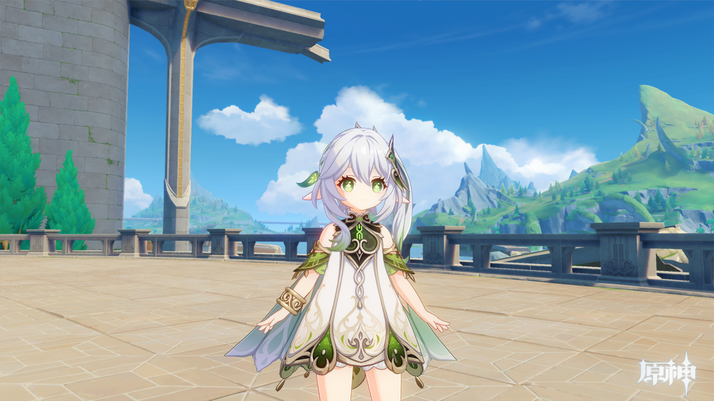
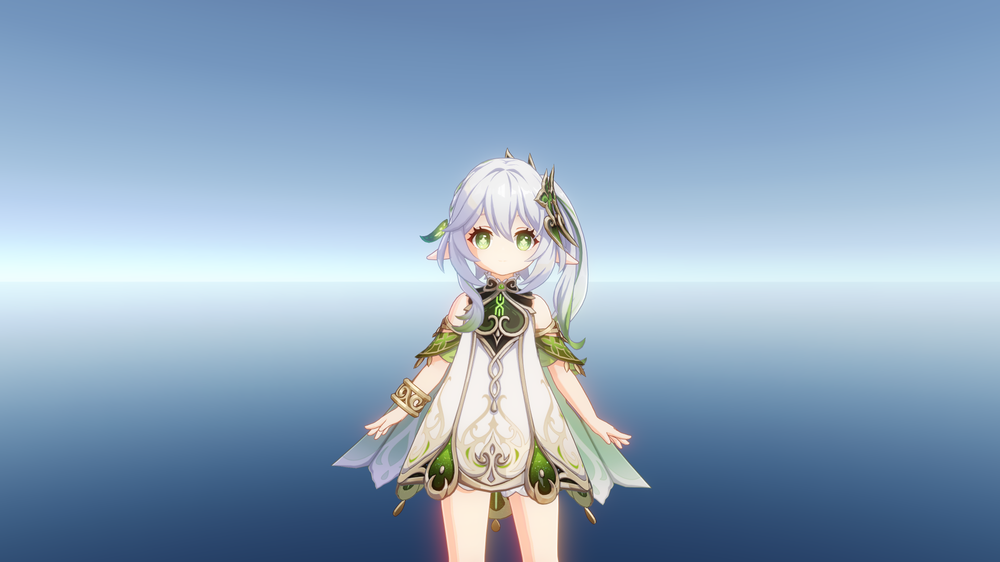

# NahidaRenderProject
A Unity sample project, for rendering Genshin characters like Nahida.

一个用于渲染原神角色 (例如纳西妲) 的 Unity 示例项目

## Requirements

Unity Version: 2022.3

URP Version: 14.0.9

## References

[UnityGenshinToonShader](https://github.com/kaze-mio/UnityGenshinToonShader)

[UnityGenshinPostProcessing](https://github.com/kaze-mio/UnityGenshinPostProcessing)

## Render Examples

